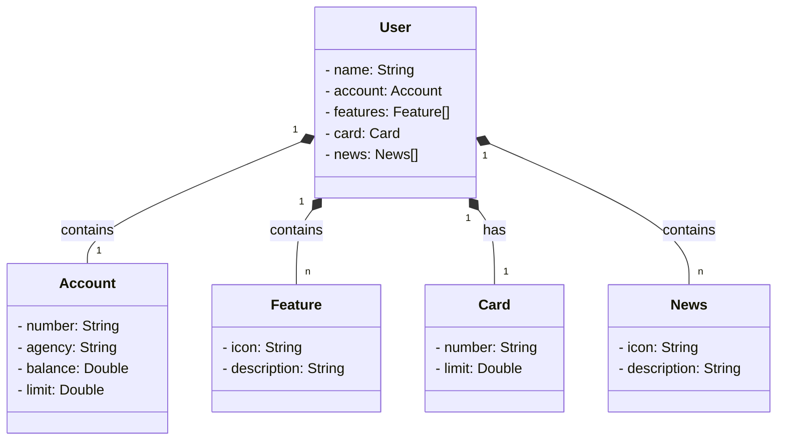

# Último projeto para o Bootcamp de Backend Java da DIO
Java RESTful API criada para o Santander Bootcamp DIO

## Diagrama de classes

```mermaid
classDiagram
  class User {
    - name: String
    - account: Account
    - features: Feature[]
    - card: Card
    - news: News[]
  }

  class Account {
    - number: String
    - agency: String
    - balance: Double
    - limit: Double
  }

  class Feature {
    - icon: String
    - description: String
  }

  class Card {
    - number: String
    - limit: Double
  }

  class News {
    - icon: String
    - description: String
  }

  User "1" *-- "1" Account : contains
  User "1" *-- "n" Feature : contains
  User "1" *-- "1" Card : has
  User "1" *-- "n" News : contains
```
